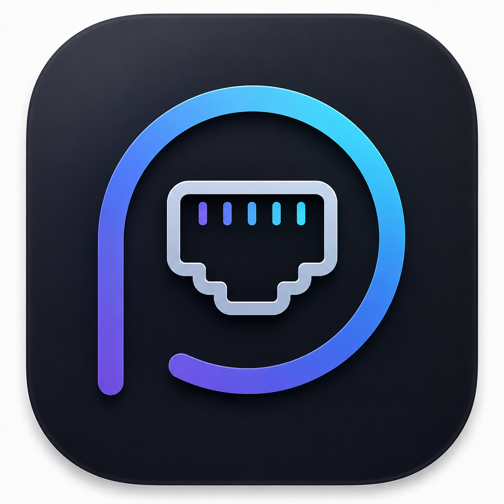

<p align="center">
  
</p>

# Port Radar (macOS)

A native macOS menu-bar app that detects dev servers listening on localhost — Vite, Next.js, Python, Docker, and anything else bound to a TCP port — and lets you inspect and kill them without hunting through terminals.

Swift + SwiftUI (`MenuBarExtra`), macOS 14+. No Xcode project: built with Swift Package Manager and edited in any editor. Xcode is required only for its toolchain.

## Build & run

From this directory (`apps/mac`):

```bash
make run      # build, assemble Port Radar.app, launch
make build    # compile only (swift build -c release)
make bundle   # build + assemble Port Radar.app without launching
make dmg      # package a drag-to-Applications installer into dist/
make clean    # remove .build/, Port Radar.app, dist/
```

Or from the repo root: `make run` (delegates here).

The Makefile wraps the compiled binary into a proper `.app` bundle because two things require one: user notifications (need a bundle identifier) and `LSUIElement` (menu-bar only, no Dock icon).

## Quick test

With Port Radar running, start a throwaway listener in another terminal:

```bash
python3 -m http.server 8128
```

It should appear in the menu bar within a few seconds as a Python row on `localhost:8128`. Use Stop there to exercise kill, or `Ctrl+C` in the terminal. Port Radar itself does not listen on a port, so it will not show up in its own list.

## How it works

- **Scan** — polls `lsof -iTCP -sTCP:LISTEN -P -n` every ~2.5 s and diffs snapshots of `(port, pid)`.
- **Resolve** — enriches each PID via native APIs: `proc_pidpath` (executable), `KERN_PROCARGS2` (full argv), `kinfo_proc` (parent PID, start time), `PROC_PIDVNODEPATHINFO` (working directory).
- **Kill** — SIGTERM with automatic escalation to SIGKILL after 4 s, or immediate SIGKILL. Confirmation required.

No root, ever. Without elevated privileges the app only sees and signals processes owned by the current user — which is exactly where dev servers live.

## Source layout

```
Sources/DevPort/
  Scanner/          lsof polling loop, snapshot diffing
  ProcessResolver/  PID → executable, argv, cwd, parent
  Models/           DevServer value types
  State/            @Observable app store
  Views/            MenuBarExtra window UI
  Actions/          terminate / force-kill / tunnels / agent
Support/Info.plist  bundle config (LSUIElement, bundle id)
```

## Distribution

Shipped as a DMG on [Releases](https://github.com/juansebsol/port-radar-mac/releases/latest).
`make dmg` produces the same installer locally.

Not on the Mac App Store: the mandatory App Sandbox forbids inspecting or signaling other
processes, which is this app's core function.
